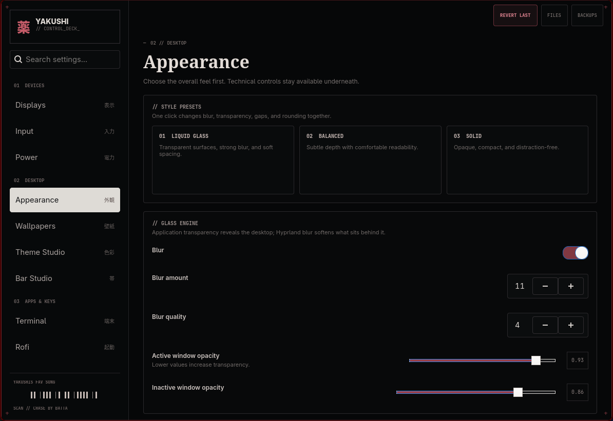

# 薬 Yakushi Control Deck

A lightweight GTK4 control deck and matching Waybar/Rofi setup for **Arch Linux + Hyprland**.



## Highlights

- No shell replacement, Electron, Node, AUR, or `yay` requirement.
- Display layout, refresh rate, scale and position controls.
- Keyboard and mouse controls with live Hyprland verification.
- Balanced / Performance power management.
- Tonal Theme Studio, desktop typography, wallpapers, Kitty and Rofi appearance.
- Matching Hyprlock lock screen and Yakushi SDDM boot login theme.
- Waybar drag-and-drop module ordering and enable/disable controls.
- `REVERT LAST` history and automatic install backups.

## Bundled Waybar + Rofi

The installer deploys a tested matching setup:

- Left click **薬** → Yakushi Control Deck
- Right click **薬** → Rofi applications
- Power button → Rofi power menu
- Shared `~/.config/hypr/colors.css` + `colors.rasi` theme roles
- Hardware-independent CPU/GPU temperature detection for common drivers

## Install

```bash
git clone https://github.com/KayamiYakushi/yakushi-control-deck.git
cd yakushi-control-deck
./install.sh
```

Fish users can run:

```fish
./install.fish
```

The installer uses official Arch repositories only. Existing Waybar, Rofi, shared color and Kitty files are backed up under:

```text
~/.config/yakushi-control-deck/install-backups/<timestamp>/
```

Launch with:

```bash
yakushi-deck
```

If your shell does not include `~/.local/bin` in `PATH`, use `~/.local/bin/yakushi-deck`. The bundled Waybar uses the absolute path and is unaffected.

## Diagnostics

```bash
./doctor.sh
```

## Update

```bash
./update.sh
```

## Restore your pre-install desktop files

```bash
./restore-last-install.sh
```

This restores the Waybar/Rofi/shared-color/Kitty files backed up immediately before the most recent install.

## Uninstall

```bash
./uninstall.sh
```

Uninstall intentionally leaves the active desktop configs in place. Pre-install backups remain available.

## Wallpaper sources

The wallpaper page indexes both `~/Pictures` and `~/Documents`. The public installer includes `hyprpaper`; Yakushi starts it on demand if it is installed but not yet running. `swww` and `awww` are also supported when already present.

## Packages

When missing, the installer installs these from official Arch repositories: Python, PyGObject, GTK4, Hyprland, Waybar, Rofi, Kitty, hyprpaper, hyprlock, pavucontrol, playerctl, brightnessctl, wl-clipboard, JetBrains Mono Nerd Font and Polkit.

## Troubleshooting

- Run `./doctor.sh` first.
- Display errors: `/tmp/yakushi-display-error.log`
- Mouse errors: `/tmp/yakushi-mouse-error.log`
- Waybar log: `/tmp/yakushi-waybar.log`
- hyprpaper log: `/tmp/yakushi-hyprpaper.log`

## License

MIT


### Rofi transparency

Rofi opacity is stored in `~/.config/rofi/yakushi-opacity.rasi` and imported last, so earlier theme rules cannot shadow the slider.


## Lock & Login

Yakushi 1.1 adds two session pages:

- **Lock Screen** manages a generated Hyprlock configuration with wallpaper, blur, backdrop brightness, 12/24-hour clock, and date visibility.
- **Login Screen** ships a real Qt6 `yakushi` SDDM theme. Its layout intentionally mirrors Hyprlock and synchronizes the Lock Screen wallpaper, clock/date preference, darkness/blur intent, Theme Studio palette, and desktop typography when staged.
- **PREVIEW SDDM** uses SDDM test mode without ending the current session.
- **INSTALL / UPDATE SDDM** first uses Polkit. If the desktop Polkit prompt fails, Yakushi automatically opens a Kitty terminal and falls back to normal `sudo` authentication. The installer copies the theme to `/usr/share/sddm/themes/yakushi`, activates it, and verifies both the theme files and active configuration.
- **DISABLE YAKUSHI SDDM** restores the previous `/etc/sddm.conf` theme selection when Yakushi had to patch it.

SDDM remains the real boot login manager; Hyprlock remains the in-session lock screen. SDDM is optional and Yakushi does not replace a different display manager automatically.

### Optional Super+M lock shortcut

To make `Super+M` lock the current Hyprland session with Hyprlock instead of logging out:

```fish
./bind-super-m-lock.fish
```

The helper supports both modern Hyprland Lua config and legacy `hyprland.conf`, creates a timestamped backup, reloads Hyprland, checks for new config errors, and verifies the resulting `Yakushi Lock Screen` bind. Logout remains available from the Rofi power menu.

### SDDM terminal install / recovery

If your Polkit setup rejects the graphical authorization prompt, run:

```bash
./install-sddm-theme.sh
```

Enter your normal Linux `sudo` password. The script refuses to report success unless `/usr/share/sddm/themes/yakushi/Main.qml` exists and SDDM resolves `Current=yakushi`. Log out normally or reboot afterward; do not restart SDDM from inside an active Hyprland session.
